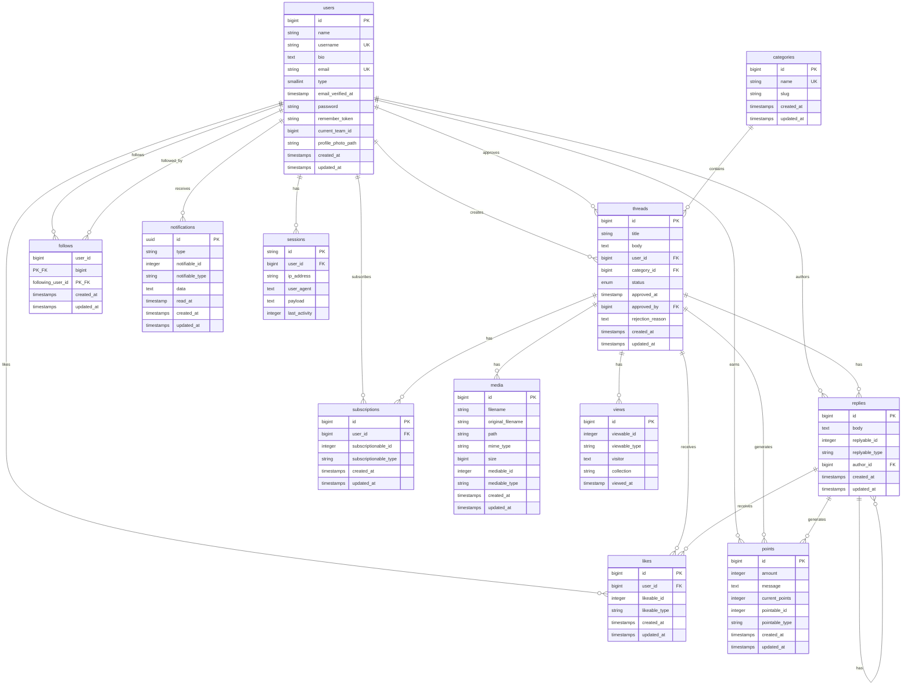

# Entity Relationship Diagram (ERD) - Liberum V11

## Mermaid ERD Diagram



## Relasi Antar Tabel

### 1. Users Table

-   **One-to-Many dengan Threads**: User dapat membuat banyak threads (`user_id`)
-   **One-to-Many dengan Threads**: User dapat menyetujui banyak threads (`approved_by`)
-   **One-to-Many dengan Replies**: User dapat menulis banyak replies (`author_id`)
-   **One-to-Many dengan Likes**: User dapat memberikan banyak likes
-   **One-to-Many dengan Subscriptions**: User dapat berlangganan banyak threads/replies
-   **Many-to-Many dengan Users** (follows): User dapat mengikuti dan diikuti banyak users
-   **One-to-Many Polymorphic dengan Notifications**: User dapat menerima banyak notifikasi
-   **One-to-Many Polymorphic dengan Points**: User dapat mendapatkan banyak points
-   **One-to-Many dengan Sessions**: User dapat memiliki banyak sessions

### 2. Categories Table

-   **One-to-Many dengan Threads**: Category dapat memiliki banyak threads

### 3. Threads Table

-   **Many-to-One dengan Users**: Thread dimiliki oleh satu user (author)
-   **Many-to-One dengan Users**: Thread dapat disetujui oleh satu admin user
-   **Many-to-One dengan Categories**: Thread termasuk dalam satu category
-   **One-to-Many Polymorphic dengan Replies**: Thread dapat memiliki banyak replies
-   **One-to-Many Polymorphic dengan Likes**: Thread dapat dilike banyak kali
-   **One-to-Many Polymorphic dengan Subscriptions**: Thread dapat disubscribe banyak user
-   **One-to-Many Polymorphic dengan Media**: Thread dapat memiliki banyak media/images
-   **One-to-Many Polymorphic dengan Views**: Thread dapat dilihat banyak kali
-   **One-to-Many Polymorphic dengan Points**: Thread dapat menghasilkan banyak points

### 4. Replies Table (Polymorphic)

-   **Many-to-One dengan Users**: Reply ditulis oleh satu user (author)
-   **Polymorphic Relation**: Reply dapat ditujukan ke Thread atau Reply lain (replyable)
-   **One-to-Many Polymorphic dengan Likes**: Reply dapat dilike banyak kali
-   **One-to-Many Polymorphic dengan Replies**: Reply dapat memiliki banyak nested replies
-   **One-to-Many Polymorphic dengan Points**: Reply dapat menghasilkan banyak points

### 5. Likes Table (Polymorphic)

-   **Many-to-One dengan Users**: Like diberikan oleh satu user
-   **Polymorphic Relation**: Like dapat diberikan ke Thread atau Reply (likeable)

### 6. Subscriptions Table (Polymorphic)

-   **Many-to-One dengan Users**: Subscription dibuat oleh satu user
-   **Polymorphic Relation**: Subscription dapat ke Thread atau Reply (subscriptionable)

### 7. Follows Table (Self-Referencing)

-   **Many-to-Many dengan Users**: User dapat mengikuti dan diikuti banyak users lain
-   Menggunakan composite primary key (`user_id`, `following_user_id`)

### 8. Notifications Table (Polymorphic)

-   **Polymorphic Relation**: Notification dapat ditujukan ke berbagai model (notifiable)

### 9. Points Table (Polymorphic)

-   **Polymorphic Relation**: Points dapat diberikan untuk berbagai aktivitas (pointable)

### 10. Media Table (Polymorphic)

-   **Polymorphic Relation**: Media dapat dimiliki oleh berbagai model (mediable)

### 11. Views Table (Polymorphic)

-   **Polymorphic Relation**: Views dapat direkam untuk berbagai model (viewable)

### 12. Sessions Table

-   **Many-to-One dengan Users**: Session dimiliki oleh satu user (optional)

## Tipe Relasi

### One-to-Many (1:N)

-   Users → Threads
-   Users → Replies
-   Categories → Threads
-   Users → Sessions

### Many-to-Many (N:M)

-   Users ↔ Users (Follows)

### Polymorphic One-to-Many (1:N Polymorphic)

-   Thread/Reply → Replies (replyable)
-   Thread/Reply → Likes (likeable)
-   Thread/Reply → Subscriptions (subscriptionable)
-   Thread → Media (mediable)
-   Thread → Views (viewable)
-   Thread/Reply → Points (pointable)
-   Users → Notifications (notifiable)

## Status Thread

-   `pending`: Menunggu approval
-   `approved`: Disetujui oleh admin
-   `rejected`: Ditolak oleh admin dengan alasan (`rejection_reason`)

## User Types

-   `1`: Regular User
-   `2`: Admin (dapat menyetujui/menolak threads)

## Perbedaan Follow vs Subscription

### 🔵 Follow (User-to-User)

**Konsep:** Mengikuti user lain untuk mendapatkan update aktivitas mereka.

**Karakteristik:**

-   **Relasi:** Many-to-Many (User ↔ User)
-   **Table:** `follows`
-   **Trait:** `HasFollows` (di User model)
-   **Target:** Hanya untuk **User**
-   **Self-Referencing:** Ya (user mengikuti user lain)

**Fungsi Utama:**

```php
// Di app/Traits/HasFollows.php
$user->follow($otherUser);           // Follow user lain
$user->unfollow($otherUser);         // Unfollow user
$user->toggleFollow($otherUser);     // Toggle follow/unfollow
$user->isFollowing($otherUser);      // Cek apakah following
$user->follows();                    // List user yang diikuti
$user->followers();                  // List follower user ini
```

**Use Case:**

-   User A mengikuti User B
-   User A akan mendapat notifikasi ketika User B:
    -   Membuat thread baru
    -   Melakukan aktivitas penting
-   Mirip dengan "follow" di Twitter/X atau Instagram

**Struktur Database:**

```
follows table:
- user_id (FK ke users)           → Yang follow
- following_user_id (FK ke users) → Yang difollow
- Composite Primary Key: (user_id, following_user_id)
```

---

### 🟢 Subscription (User-to-Content)

**Konsep:** Berlangganan konten tertentu (thread/reply) untuk mendapatkan notifikasi update.

**Karakteristik:**

-   **Relasi:** Polymorphic One-to-Many
-   **Table:** `subscriptions`
-   **Trait:** `HasSubscriptions` (di Thread & Reply model)
-   **Target:** Bisa untuk **Thread** atau **Reply**
-   **Polymorphic:** Ya (subscriptionable_type & subscriptionable_id)

**Fungsi Utama:**

```php
// Di app/Traits/HasSubscriptions.php
$thread->subscriptions();            // List subscribers thread ini
$thread->hasSubscriber($user);       // Cek apakah user subscribe

// Contoh penggunaan:
$subscription = Subscription::create([
    'user_id' => $user->id,
    'subscriptionable_type' => Thread::class,
    'subscriptionable_id' => $thread->id,
]);
```

**Use Case:**

-   User subscribe ke Thread yang menarik
-   User akan mendapat notifikasi ketika:
    -   Ada reply baru di thread tersebut
    -   Ada update pada thread
-   User subscribe ke Reply tertentu
-   Mirip dengan "subscribe" di forum atau "watch" di GitHub issues

**Struktur Database:**

```
subscriptions table:
- id (PK)
- user_id (FK ke users)            → Subscriber
- subscriptionable_type (string)    → 'App\Models\Thread' atau 'App\Models\Reply'
- subscriptionable_id (integer)     → ID dari Thread atau Reply
```

---

### 📊 Perbandingan

| Aspek           | Follow                       | Subscription                              |
| --------------- | ---------------------------- | ----------------------------------------- |
| **Relasi**      | User → User                  | User → Content (Thread/Reply)             |
| **Tipe Relasi** | Many-to-Many                 | Polymorphic One-to-Many                   |
| **Target**      | User saja                    | Thread atau Reply                         |
| **Tujuan**      | Ikuti aktivitas user         | Ikuti update konten                       |
| **Notifikasi**  | Aktivitas user yang difollow | Update pada thread/reply yang disubscribe |
| **Use Case**    | Social networking            | Content engagement                        |
| **Trait**       | `HasFollows`                 | `HasSubscriptions`                        |
| **Model**       | User                         | Thread, Reply                             |

---

### 💡 Contoh Skenario Penggunaan

**Skenario 1: Follow**

```
User Alice mengikuti User Bob
→ Alice akan mendapat notifikasi setiap Bob membuat thread baru
→ Alice bisa melihat aktivitas Bob di timeline/feed
```

**Skenario 2: Subscription**

```
User Alice subscribe ke Thread "Laravel 11 Tips"
→ Alice akan mendapat notifikasi setiap ada reply baru di thread tersebut
→ Alice tidak perlu follow semua user yang reply di thread itu
```

**Skenario 3: Kombinasi**

```
User Alice mengikuti User Bob (Follow)
User Alice subscribe ke Thread "Laravel 11 Tips" milik Bob (Subscription)

Hasil:
- Alice mendapat notifikasi dari semua aktivitas Bob (karena follow)
- Alice mendapat notifikasi khusus untuk thread "Laravel 11 Tips" (karena subscription)
- Jika thread tersebut sangat aktif, Alice bisa unsubscribe tapi tetap follow Bob
```

---

## Catatan Implementasi

-   Menggunakan Laravel's Polymorphic Relations untuk fleksibilitas
-   Soft deletes pada beberapa model untuk data preservation
-   Timestamps otomatis pada semua tabel
-   Foreign key constraints dengan cascade/set null untuk data integrity
-   UUID untuk notifications table
-   View tracking menggunakan package `eloquent-viewable`
-   Points system untuk gamifikasi platform
-   **Follow:** Untuk relasi sosial antar user
-   **Subscription:** Untuk engagement dengan konten spesifik

---

**Created:** November 2, 2025  
**Updated:** November 2, 2025  
**Laravel Version:** 11.46.1  
**Database:** MySQL/MariaDB
