# Use Case Diagram - LiberumV11

Below is the use case diagram for the LiberumV11 forum application, showing the main actors and their interactions with the system.

```plantuml
@startuml LiberumV11 Use Cases

skinparam actorStyle awesome

' Actors
:Guest: as guest
:User: as user
:Admin: as admin
user <|- guest
admin <|- user

' Use cases
rectangle LiberumV11 {
    ' Authentication & Profile
    (Register) as register
    (Login) as login
    (Manage Profile) as manageProfile
    (View Profile) as viewProfile
    (Follow/Unfollow User) as followUser

    ' Thread Management
    (View Threads) as viewThreads
    (Create Thread) as createThread
    (Edit Thread) as editThread
    (Delete Thread) as deleteThread
    (Like Thread) as likeThread

    ' Reply Management
    (Add Reply) as addReply
    (Edit Reply) as editReply
    (Delete Reply) as deleteReply

    ' Admin Functions
    (Manage Categories) as manageCategories
    (Moderate Threads) as moderateThreads
    (Manage Users) as manageUsers
    (View Dashboard) as viewDashboard

    ' Category & Navigation
    (View Categories) as viewCategories
    (Filter by Category) as filterCategory

    ' Media Management
    (Upload Images) as uploadImages
    (View Media) as viewMedia
}

' Guest Relations
guest --> register
guest --> login
guest --> viewThreads
guest --> viewCategories
guest --> filterCategory
guest --> viewProfile
guest --> viewMedia

' User Relations
user --> manageProfile
user --> followUser
user --> createThread
user --> editThread
user --> deleteThread #line:red;line.bold
user --> likeThread
user --> addReply
user --> editReply
user --> deleteReply
user --> uploadImages

' Admin Relations
admin --> manageCategories
admin --> moderateThreads
admin --> manageUsers
admin --> viewDashboard

' Include/Extend Relations
createThread ..> uploadImages : <<include>>
addReply ..> uploadImages : <<include>>
editThread ..> uploadImages : <<include>>
moderateThreads ..> (Approve Thread) : <<include>>
moderateThreads ..> (Reject Thread) : <<include>>
manageUsers ..> (Promote User) : <<include>>
manageUsers ..> (Demote User) : <<include>>
manageUsers ..> (Delete User) : <<include>>

note right of viewThreads
  All users can view threads,
  but only authenticated users
  can interact with them
end note

note right of manageUsers
  Admins can promote/demote
  users and manage their
  access levels
end note

@enduml
```

## Use Case Description

### Actors

1. **Guest**

    - Unregistered visitor who can view public content
    - Can register for an account
    - Can view threads and profiles

2. **User** (extends Guest)

    - Registered and authenticated member
    - Can create and manage their own content
    - Can interact with other users' content
    - Can follow other users

3. **Admin** (extends User)
    - Has full moderation capabilities
    - Can manage categories
    - Can manage users
    - Can approve/reject threads

### Main Use Cases

#### Authentication & Profile

-   **Register**: Create a new account
-   **Login**: Authenticate into the system
-   **Manage Profile**: Update profile information and photo
-   **View Profile**: View user profiles and statistics
-   **Follow/Unfollow User**: Manage user relationships

#### Thread Management

-   **View Threads**: Browse through forum threads
-   **Create Thread**: Create new discussion threads
-   **Edit Thread**: Modify own threads
-   **Delete Thread**: Remove own threads
-   **Like Thread**: Show appreciation for threads

#### Reply Management

-   **Add Reply**: Comment on threads
-   **Edit Reply**: Modify own replies
-   **Delete Reply**: Remove own replies

#### Admin Functions

-   **Manage Categories**: Create/edit/delete categories
-   **Moderate Threads**: Approve/reject threads
-   **Manage Users**: Promote/demote/delete users
-   **View Dashboard**: Access admin statistics

#### Media Management

-   **Upload Images**: Add images to threads/replies
-   **View Media**: Browse uploaded media

## Relationships

### Include Relationships

-   Creating/editing threads and replies includes the ability to upload images
-   Thread moderation includes approval and rejection capabilities
-   User management includes promotion, demotion, and deletion capabilities

### Access Levels

-   Guests have read-only access to public content
-   Users can create and manage their own content
-   Admins have full system management capabilities

## Notes

-   The system uses Laravel Jetstream for authentication
-   Media handling is managed through Laravel's file storage system
-   Admin functions are protected by middleware
-   Thread moderation system ensures content quality
